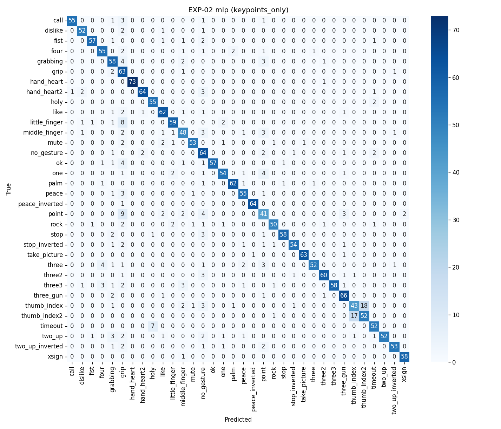
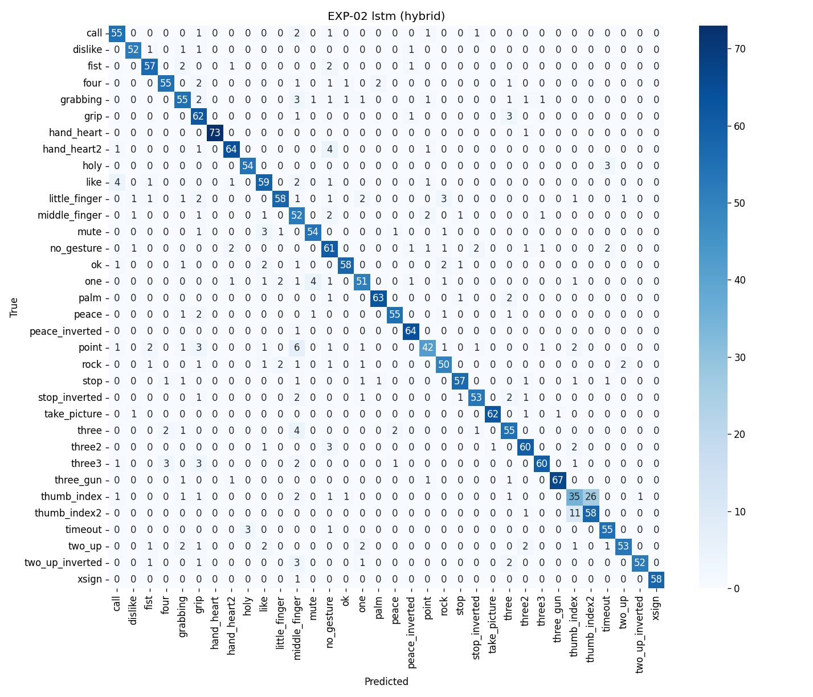

# 机器学习大作业 Gesticulate 实验报告
2023012134 王振宇
本项目已开源
---

## 研究背景

传统人机交互依赖物理键盘与鼠标，在免接触场景、智能办公与辅助技术中往往存在操作不便的问题。本项目 **Gesticulate** 旨在构建一套基于普通网络摄像头的视觉手势识别系统：从视频帧中提取手部几何与外观特征，经机器学习分类器识别手势意图，并将识别结果映射为操作系统级键盘事件，实现低延迟的隔空操控。

研究动机与问题设定如下：

1. 任务目标：在固定手势词表（如 stop、palm、fist、like、one、ok、grip、thumb_index 等）上实现稳定的多类分类，并支持实时推理与按键映射。
2. 特征与算法权衡：手势既包含关节拓扑与弯曲等几何结构，也包含肤色、边缘与光照下的外观信息。需在 Keypoint/几何描述子、HOG 纹理特征及其融合表示上，系统比较经典机器学习与浅层/序列深度学习方法的判别能力与效率。
3. 域泛化：训练数据来自复杂背景的 HaGRID 子集（域内），测试泛化则借助背景干净、近红外的 LeapGestRecog（域外 OOD），考察模型在采集条件变化下的鲁棒性。
4. 工程复现：数据索引、特征存储、模型训练、评估与部署分层解耦，全部实验通过配置驱动并产出可版本化的工件（manifest、parquet、metrics JSON），便于复现与对比。

项目整体推进流程：数据摄入与划分 → 离线特征提取 → 算法对比与特征消融（EXP-01/02）→ 跨数据集鲁棒性（EXP-03）→ 实时摄像头推理与按键映射（EXP-04）。

---

## 实验环境

1. 模型训练机
 - WSL Ubuntu 24.04
 - Python3.12 & Miniconda

2. 实时系统机
 - Windows 11
 - Python3.12 & Miniconda
 - 内置摄像机

---

## 实验设计

实验围绕四条可自动复现的流水线展开，共享同一套数据契约、特征版本与划分协议，以保证对比公平。

### 实验矩阵

| 实验 ID | 类型 | 训练数据 | 评估数据 | 变量 | 主要关注点 |
| --- | --- | --- | --- | --- | --- |
| EXP-01 | 算法对比 | HaGRID 子集 train | HaGRID 子集 val | 9 种分类器 | 在 hybrid 特征下比较 accuracy、F1、训练/推理耗时 |
| EXP-02 | 特征消融 | HaGRID 子集 train | HaGRID 子集 val | `keypoints_only` / `hog_only` / `hybrid` | 固定算法，比较特征族对精度与维度的影响 |
| EXP-03 | 跨域鲁棒性 | HaGRID 子集（EXP-02 已训模型） | HaGRID test + LeapGestRecog OOD | 全部算法×特征族 | 域内精度、OOD 精度、绝对/相对性能跌落 |
| EXP-04 | 实时部署 | 模型导出物 | 摄像头实时流 | 端到端延迟、FPS | 推理稳定性与按键映射（本报告略述） |

EXP-01 与 EXP-02 在实现上共用 `run_single_experiment` 入口：前者固定 `feature_family=hybrid`，后者对三种特征族做笛卡尔积 sweep。本报告将二者合并汇报为「算法×特征」全表。

### 数据划分与验证策略

- 主数据集：HaGRID 子集，按类别分层划分为 70% train / 15% val / 15% test（`random_state=42`）。
- 交叉验证：在 train 子集上额外生成 5 折分层 CV 折定义，供超参搜索与稳定性分析；主表指标以 hold-out validation 集为准。
- OOD 评估：在 HaGRID 上训练完成的模型权重，零样本直接在 LeapGestRecog 特征矩阵上推理，不做微调。

### 对照与公平性约束

- 所有算法读取同一 `data/splits/hagrid_subset_train_val_test.json` 中的 sample_id 列表。
- 特征矩阵来自预处理 parquet 工件，实验脚本不直接扫描原始图像。
- 需标准化的算法（KNN、SVM、Logistic Regression、MLP、CNN、LSTM）在训练前对特征做 `StandardScaler` 拟合；树模型与朴素贝叶斯不做缩放。
- 深度基线统一训练 20 epoch、`learning_rate=0.001`，与 `configs/models/baselines.yaml` 中登记的超参一致。

### 特征族

| 实验别名 | 实际特征内容 | 典型维度 |
| --- | --- | --- |
| `keypoints_only` | 几何描述子（腕部归一化坐标 + 成对距离 + 关节角） | 260 |
| `hog_only` | 手部裁剪区 HOG 描述子 | 1764 |
| `hybrid` | 几何 + HOG 拼接 | 2024 |

---

## 数据准备与预处理
### 数据集概况

本项目使用两个公开手势图像数据集，分别承担域内训练评估与域外泛化测试角色。二者在采集设备、成像模态、背景复杂度与原始标签体系上差异显著，便于在 EXP-03 中量化跨域性能跌落。

#### HaGRID 子集（域内主数据集）

[HaGRID](https://github.com/hukenovs/hagrid)（HAnd Gesture Recognition Image Dataset）是大规模真实场景手势图像数据集，图像由普通 RGB 摄像头在多样化室内/室外环境中采集，包含复杂背景、不同光照与多用户手部形态变化，更贴近本项目的摄像头实时应用设定。在本实验中我们采用了官方的少样本子集。

| 属性 | 说明 |
| --- | --- |
| 原始路径 | `data/raw/hagrid/HaGRIDv2_dataset_512/` |
| 成像特点 | RGB 彩色图；子集目录名表示短边约 512 px，长宽比随样本变化（如 512×684、910×512 等） |
| 原始规模 | 完整 HaGRID v2 含百万级样本、数十种手势类别 |
| 本项目子集 | 每类配置上限 500 张（`max_samples_per_class`），共 17000 张、34 类 |
| 类别示例 | `stop`、`palm`、`fist`、`like`、`one`、`ok`、`grip`、`thumb_index`、`peace`、`call` 等 |
| 划分 | 分层 70% / 15% / 15% → train 11899 / val 2550 / test 2551 |

子集通过 `hagrid_adapter` 索引：支持 annotation JSON 或按类别文件夹遍历，保留 `background` 等 `capture_context` 元数据。标签保持 HaGRID 原生文件夹名，不做跨数据集重映射。
在官方子集的基础上，本实验再次将每一类别降采样为 500 张 / 类，这样做主要是为了在实验设备有限的内存下完成特征提取与模型计算。如有需要请调整 `configs/datasets/hagrid_subset.yaml` 配置。

**样本展示**（类别 `ok`，RGB 512×683，复杂室内背景）：


*图：HaGRID 子集示例 `ok/93cf1318-e1a1-45b1-b7cb-9a9955cc0e88.jpg`。可见真实场景下的彩色成像、非均匀光照与杂乱背景，手部仅占画面一部分。*

#### LeapGestRecog（域外 OOD 数据集）

[LeapGestRecog](https://www.kaggle.com/datasets/gti-upm/leapgestrecog) 是 GTI-UPM 发布的静态手势图像集，由 Leap Motion 近红外传感器采集，背景干净、姿态标准化，与 HaGRID 的真实场景分布形成鲜明域偏移，适合作为零样本 OOD 测试集。

| 属性 | 说明 |
| --- | --- |
| 原始路径 | `data/raw/leapgestrecog/` |
| 成像特点 | 近红外灰度图，分辨率 640×240；全幅画面中手部通常位于中央区域 |
| 目录结构 | `leapGestRecog/<受试者编号>/<手势文件夹>/帧图像` |
| 受试者 | 10 人（subject `00`–`09`） |
| 原始手势 | 10 类文件夹：`01_palm` … `10_down`，每类 4 000 张，合计 40 000 张 |
| 划分 | 不参与训练；`split_strategy` 将全部样本划入 test（OOD 评估专用） |
| 实验角色 | EXP-03 零样本跨域测试（模型在 HaGRID 上训练后直接推理） |

LeapGestRecog 原始标签为 `01_palm` 等文件夹编码，与 HaGRID 命名不一致。项目在 manifest 构建阶段通过 `label_mapper` 将其对齐到 HaGRID 词表，以便与域内训练标签空间可比。映射后 LeapGestRecog 覆盖 8 个 HaGRID 原生类（如 `fist`、`like`、`one`、`ok`、`grip`、`palm`、`thumb_index` 等）；EXP-03 中的共有类子集指标仅统计两套数据标签交集上的 OOD 精度，以排除仅存在于单一数据集的类别干扰。

**样本展示**（原始文件夹 `07_ok` → 映射标签 `ok`，近红外 640×240，受试者 `07`）：


*图：LeapGestRecog 示例 `leapGestRecog/07/07_ok/frame_07_07_0057.png`。近红外灰度成像，背景干净、手部居中且姿态标准化；与上方 HaGRID 同标签 `ok` 对比，可直观感受 RGB 真实场景与 OOD 采集条件之间的域偏移。*

#### 两数据集对比小结

| 维度 | HaGRID 子集 | LeapGestRecog |
| --- | --- | --- |
| 域角色 | 域内（in-domain） | 域外（OOD） |
| 模态 | RGB、复杂背景 | 近红外、静态干净背景 |
| 本项目样本量 | 17 000（34 类×500） | 40 000（10 原始类×4 000） |
| 是否参与训练 | 是 | 否（仅评估） |
| 标签体系 | HaGRID 原生类名 | 映射至 HaGRID 词表 |

### 数据集同步相关说明
由于两个数据集标签有不同，在此处本实验中将数据集 `LeapGestRecog` 的标签向 `HaDRID` 标签对齐。
具体地：
| LeapGestRecog | HaDRID | 备注 |
| --- | --- | --- |
| 01_palm 08_palm_moved | stop | `LeapGestRecog` 中的 palm 为并指，形态特征更类似于 `HaDRID` 中的 stop |
| 02_l | thumb_index | 大拇指+食指 |
| 03_fist 04_fist_moved | fist | - |
| 05_thumb | like | 实际上`LeapGestRecog` 中的 thumb 为向右，`HaDRID` 中不存在类似动作 |
| 06_index | one | - |
| 07_ok | ok | - |
| 09_c | grip | - |
| 10_down | palm | - |

### 实验步骤
请参考

1. 下载原始数据并放置
- HaGRID：`data/raw/hagrid/HaGRIDv2_dataset_512/`
- LeapGestRecog：`data/raw/leapgestrecog/`

2. 构建样本清单（manifest）
通过 `dataset_registry` 选择适配器，将两套数据索引为统一 schema：
```text
sample_id, dataset_name, subject_id, gesture_label, image_path, split, capture_context
```
- HaGRID：支持 annotation JSON 或按文件夹名解析；每类采样上限 500 张（`max_samples_per_class`），控制 Phase 2 内存占用。
- LeapGestRecog：按 `subject_id / NN_gesture / frame` 目录遍历；标签经 `label_mapper` 映射到 HaGRID 词表（见上表）。

3. 生成划分

`split_generator.create_primary_splits` 做分层 70/15/15 划分；`create_stratified_folds` 在 train 上生成 5 折 CV。结果写入 `data/splits/hagrid_subset_train_val_test.json` 与 `hagrid_subset_cv_folds.json`。

4. 批量特征提取
`extract_features.py` 对 manifest 中每张图像：
1. OpenCV 读图 → MediaPipe Hand Landmarker 检测 21 关键点；
2. 按 `feature_family` 生成 `geometric` 或 `hog` 向量；
3. 检测失败时写入零向量并标记 `quality_flags`。
多进程 `spawn` 池并行提取（可配置 `num_workers`），按 batch 刷写 parquet，保证 `sample_id` 顺序与 manifest 一致。

5. 构建 hybrid 特征
`build_hybrid_features.py` 按 `sample_id` 对齐 geometric 与 hog 矩阵，按固定顺序拼接为 `hybrid_keypoints_hog`，输出 `artifacts/features/hagrid_subset_hybrid_v1.parquet`。LeapGestRecog 重复相同流程，供 EXP-03 OOD 评估。

6. 质量检查
`quality_checks` 统计检测成功率、低置信度样本比例；对 OOD 近红外图像，配置中将 `min_detection_confidence` 降至 0.3 以提高召回。

---

## 特征设计
特征提取由 `src/features/` 模块实现，离线批处理与实时推理共用同一套几何/HOG 逻辑。系统支持三种实验级特征族，底层对应 `geometric`、`hog` 与二者拼接的 `hybrid_keypoints_hog`。

### Keypoint

检测：使用 MediaPipe Hand Landmarker（21 个 3D 关节点 $\mathbf{P}_i=(x_i,y_i,z_i)$），输出归一化坐标与像素坐标，并记录 handedness 与置信度。预处理支持可选 CLAHE、半幅裁剪与放大，以适配 OOD 近红外全幅图像。

几何描述子（实验中的 `keypoints_only`，存储列名为 `geometric`）在 `geometric_features.py` 中构造，包含三部分：

1. 腕部相对归一化坐标（平移+尺度不变）  
   以腕点 $\mathbf{P}_0$ 为原点，用手部包围盒对角线长度 $L$ 缩放：  
   $\mathbf{P}'_i = (\mathbf{P}_i - \mathbf{P}_0) / L$，取 $xy$ 展平为 42 维。

2. 成对欧氏距离（上三角）  
   $D_{ij}=\|\mathbf{P}'_i-\mathbf{P}'_j\|_2$，共 $C_{21}^2=$ 210 维，编码手指张开程度与手型拓扑。

3. 选定关节夹角（8 组三元组，如掌根–指根–指尖）  
   $\theta=\arccos\!\left(\frac{\mathbf{v}_1\cdot\mathbf{v}_2}{\|\mathbf{v}_1\|\|\mathbf{v}_2\|}\right)$，捕获屈伸状态，8 维。

合计 260 维 固定长度向量。另在管线中保留 `keypoints_raw`（21×3=63 维原始归一化坐标）供调试，主实验未单独 sweep。

### HOG

HOG（Histogram of Oriented Gradients，方向梯度直方图）核心思想是：在图像局部区域内统计梯度方向的分布，用边缘结构而非原始像素强度描述外观。对轻微光照变化，梯度方向相对稳定，因此 HOG 常用于行人/物体检测；在本项目中，HOG 承担手部区域纹理与轮廓的补充编码，与关键点几何描述子形成互补。

#### 算法定义

对灰度图 $I$，在像素 $(x,y)$ 处用中心差分近似梯度：

$$
G_x = I(x+1,y) - I(x-1,y),\quad
G_y = I(x,y+1) - I(x,y-1)
$$

梯度幅值与方向为：

$$
m(x,y) = \sqrt{G_x^2 + G_y^2},\quad
\theta(x,y) = \mathrm{atan2}(G_y, G_x)
$$

将 $\theta$ 量化到 $B$ 个方向 bin（本项目 $B=9$，覆盖 $[0°,180°)$，即无符号梯度）。以 `pixels_per_cell = (8,8)` 将图像划分为 $8\times8$ 像素的 **cell**，在 cell 内对落入各方向 bin 的梯度幅值做加权累加，得到该 cell 的 $B$ 维方向直方图。

为增强局部对比度与光照鲁棒性，将相邻 $2\times2$ 个 cell 组成一个 **block**，对 block 内 $2\times2\times B = 36$ 维向量做 **L2-Hys** 归一化（先 L2 归一化，再 clip 至阈值 0.2，再 L2 归一化）。`transform_sqrt=True` 表示在计算梯度前对像素强度做平方根变换，压缩高亮区域、缓和光照不均。

最终描述子为所有 block 归一化后特征按光栅顺序拼接而成的固定长度向量（`feature_vector=True`）。


### Keypoint + HOG

实验别名 `hybrid` 在存储层对应 `feature_family=hybrid_keypoints_hog`，由几何与 HOG 两路离线特征按 `sample_id` 对齐后拼接得到。

**离线构建**（`build_hybrid_features.py`）：

1. 分别加载 `hagrid_subset_geometric_v1.parquet` 与 `hagrid_subset_hog_v1.parquet`，建立 `sample_id → record` 索引；
2. 对每个共有 `sample_id`，调用 `concatenate_features({"geometric": v_geom, "hog": v_hog}, family_order=("geometric", "hog"))`；
3. 合并两侧 `quality_flags`（任一侧 `detection_failed` / `low_confidence` 均保留）；
4. 写出 `hybrid_keypoints_hog` parquet 及配套 manifest / quality JSON。

拼接顺序由 `configs/features/default.yaml` 中 `hybrid.concat_order: [keypoints_only, hog_only]` 约定，实际块名为 `geometric` + `hog`，总维 **260 + 1764 = 2024**。

**在线推理**（`runtime/preprocess.extract_runtime_features`）：对同一帧只调用一次 MediaPipe，分别走几何分支与 HOG 分支后即时拼接，避免双次检测带来的不一致。

**深度模型消费方式**见上文「深度模型中的 HOG 布局」：`feature_layout.resolve_feature_layout` 将前 260 维与后 1764 维拆分，几何走 MLP、HOG 走 CNN/LSTM 空间结构分支（`HybridCNNClassifier` / `HybridLSTMClassifier`）。经典分类器（KNN、RF、LR 等）则将 2024 维作为展平向量整体输入，经 `StandardScaler` 后训练。

---

## 算法实现

九种分类器通过 `model_registry` 统一注册，由 `classical_trainer` 或 `deep_baseline_trainer` 训练，输出格式一致的 metrics 与导出物（joblib / torch）。

### KNN

自定义 K 近邻（`KNNClassifier`），默认 $k=5$。训练阶段仅缓存训练集；预测时用 batched 欧氏距离（$\|x-y\|^2=\|x\|^2+\|y\|^2-2x\!\cdot\!y$）避免大矩阵 OOM，对近邻标签多数投票。支持 `predict_proba`（邻居类别频率）。特征经 `StandardScaler` 标准化。

### Decision Tree

CART 决策树（`DecisionTreeClassifier`），`max_depth=10`，`min_samples_leaf=2`。不缩放特征。

### Random Forest

随机森林集成（`RandomForestClassifier`），`n_estimators=50`，`max_depth=10`，`max_features=sqrt`。通过自助采样与特征子采样降低方差，在 keypoints 特征上表现稳健，但训练耗时随树数量显著增加。

### Naive Bayes

高斯朴素贝叶斯（`GaussianNBClassifier`），`var_smoothing=1e-9`。假设特征条件独立，训练与推理极快，适合基线对比，对 correlated 几何/HOG 维度适应性有限。

### Logistic Regression

多项逻辑回归（`LogisticRegressionClassifier`），$L_2$ 正则 `C=1.0`，`max_iter=500`。对线性可分或近似线性边界有效；在 hybrid 特征上可达中等精度且推理延迟极低。

### SVM

一对多 SVM（`SVMClassifier`），默认 RBF 核（`C=1.0`，`gamma=scale`），采用 Platt SMO 求解二分类子问题。大训练集时对 Gram 矩阵分块计算并子采样加速。

### MLP

多层感知机（PyTorch `build_mlp`）：输入为展平特征向量，隐层 `[128, 64]`，ReLU + Dropout(0.2)，输出 softmax 多类。

### CNN

HOG 块网格卷积网络（`HogCNNClassifier` / `HybridCNNClassifier`）：将 HOG 重塑为 $(C,H,W)$ 后堆叠 Conv2d–ReLU–MaxPool 与自适应池化；hybrid 模式下几何分支经 MLP 与 CNN 特征拼接再分类。

### LSTM

HOG 序列 LSTM（`HogLSTMClassifier` / `HybridLSTMClassifier`）：将 49 个 HOG block 作为 `seq_len=49` 的序列输入 LSTM（`hidden_size=64`，`num_layers=1`），取末时刻隐状态分类；hybrid 模式同样融合几何 MLP 分支。性能与 CNN 接近，对 block 顺序敏感，适合建模 HOG 空间扫描模式。

深度学习训练：深度模型 batch 训练 20 epoch，Adam `lr=0.001`，标签编码为整数索引；验证集上记录 `fit_seconds`、`inference_seconds` 与 `per_sample_inference_ms`。

---

## 指标设计

指标由 `src/evaluation/metrics.py` 与 `robustness_metrics.py` 统一计算，保证各实验 JSON/排行榜列名一致。

### EXP-01 & EXP-02

分类质量（在 HaGRID validation 集上）：

| 指标 | 说明 |
| --- | --- |
| `accuracy` | 正确分类样本占比，主排序指标 |
| `precision_macro` / `recall_macro` / `f1_macro` | 各类别指标算术平均，缓解类别不均衡 |
| `precision_micro` / `recall_micro` / `f1_micro` | 全局汇总 TP/FP/FN，多类任务中与 accuracy 一致 |
| `confusion_matrix` | 多类混淆矩阵，导出 CSV 与热力图 |

效率（`compute_efficiency_metrics`）：

| 指标 | 说明 |
| --- | --- |
| `fit_seconds` | 训练墙钟时间（含特征加载与缩放） |
| `inference_seconds` | 在完整 validation 集上推理总耗时 |
| `per_sample_inference_ms` | 单样本平均推理毫秒数，用于实时部署可行性筛选 |

EXP-02 在以上指标基础上，额外按 `feature_family` 维度展开，形成算法×特征族对比表；消融解读时关注 HOG-only 相对 keypoints/hybrid 的精度落差，以及维数增加带来的训练/推理成本。

### EXP-03

在域内 test 与 LeapGestRecog OOD 上，对 EXP-02 已导出模型做零样本推理，核心鲁棒性指标如下：

| 指标 | 定义 |
| --- | --- |
| `in_domain_accuracy` | HaGRID test（或协议指定的域内 held-out）上的 accuracy |
| `ood_accuracy` | LeapGestRecog 全类 OOD accuracy |
| `absolute_accuracy_drop` | $\Delta = \text{in\_domain\_accuracy} - \text{ood\_accuracy}$ |
| `relative_performance_retention` | $\text{ood\_accuracy} / \text{in\_domain\_accuracy}$，衡量相对保留比例 |
| `ood_shared_subset_accuracy` | 仅在 HaGRID 与 LeapGestRecog 共有 7 类手势子集上统计的 OOD accuracy（排除仅存在于某一数据集的类别） |

补充协议（`compute_ood_eval_protocols`）：

- masked_unknown：将落在 OOD 词表外的预测映射为 `unknown` 后再计分，分析“幻觉类别”比例。
- masked_shared_argmax：在 `predict_proba` 可用时，将决策限制在共有类集合上的 masked argmax，评估受限词表下的上界表现。
- per_class_shift：逐类对比域内/OOD accuracy 与 `absolute_drop`，定位最易退化的手势（如 like、thumb_index 等映射敏感类）。
- misclassification_concentration：统计 OOD 上高频混淆对 $(y_{\text{true}}, y_{\text{pred}})$，辅助定性误差分析。

EXP-03 主表以 `ood_accuracy` 与 `absolute_accuracy_drop` 排序，用于选择跨域更稳健的算法–特征组合；结合 EXP-01/02 的域内精度与 `per_sample_inference_ms`，为 EXP-04 实时部署选定冠军配置。

---

<!-- ## 实验 EXP-01
### 实验步骤

### 实验结果

模型对比实验（EXP-01）：在 **hybrid** 特征与统一划分协议下，比较各分类器在验证集上的性能（共 9 组 completed run，主指标 accuracy）。

| 算法 | accuracy | f1_macro | recall_macro | precision_macro | fit_seconds | inference_seconds | per_sample_inference_ms |
| --- | --- | --- | --- | --- | --- | --- | --- |
| cnn | 0.8786 | 0.8801 | 0.8793 | 0.8844 | 8.0049 | 0.0349 | 0.0159 |
| lstm | 0.8772 | 0.8774 | 0.8770 | 0.8811 | 8.4692 | 0.0460 | 0.0209 |
| mlp | 0.8568 | 0.8614 | 0.8580 | 0.8720 | 6.7858 | 0.0693 | 0.0315 |
| random_forest | 0.8518 | 0.8621 | 0.8470 | 0.8863 | 313.7350 | 0.3636 | 0.1654 |
| logistic_regression | 0.8199 | 0.8236 | 0.8198 | 0.8401 | 14.9142 | 0.0030 | 0.0013 |
| knn | 0.8186 | 0.8187 | 0.8169 | 0.8328 | 0.1225 | 0.7715 | 0.3509 |
| naive_bayes | 0.8117 | 0.8207 | 0.8292 | 0.8325 | 0.0480 | 0.6431 | 0.2924 |
| decision_tree | 0.8008 | 0.8127 | 0.7952 | 0.8426 | 236.3971 | 0.0647 | 0.0294 |
| svm | 0.7299 | 0.7475 | 0.7240 | 0.8856 | 559.0951 | 1.7226 | 0.7834 |

## 实验 EXP-02
### 实验步骤

### 实验结果

特征消融实验（EXP-02）：固定算法、比较 **keypoints_only / hog_only / hybrid** 三种特征族在验证集上的 accuracy

| 算法 | keypoints_only | hog_only | hybrid |
| --- | --- | --- | --- |
| cnn | 0.7758 | 0.5184 | 0.8786 |
| lstm | 0.8654 | 0.4537 | 0.8772 |
| mlp | 0.8772 | 0.6227 | 0.8568 |
| random_forest | 0.8663 | 0.2545 | 0.8518 |
| knn | 0.8622 | 0.6071 | 0.8186 |
| decision_tree | 0.8131 | 0.2224 | 0.8008 |
| naive_bayes | 0.7576 | 0.5337 | 0.8117 |
| logistic_regression | 0.7326 | 0.5306 | 0.8199 |
| svm | 0.5484 | 0.6125 | 0.7299 |

各特征族下 accuracy 最高的算法：

| 特征族 | 最优算法 | accuracy |
| --- | --- | --- |
| keypoints_only | mlp | 0.8772 |
| hog_only | mlp | 0.6227 |
| hybrid | cnn | 0.8786 | -->

## 实验 EXP-01 $\times$ EXP-02
由于实验一与实验二本质相同，因此在此报告中我们将两个实验共同汇报
### 实验步骤

本阶段在 manifest + 划分 与 特征 parquet 完成后执行，统一入口为 `run_single_experiment`（`src/models/experiment_runner.py`）：从 split JSON 读取 train/val 样本 ID，加载对应特征矩阵，经 `classical_trainer` 或 `deep_baseline_trainer` 训练后在 validation 集上计分，并导出模型工件与 metrics JSON。

前置条件：`data/splits/hagrid_subset_train_val_test.json` 已生成；`artifacts/features/hagrid_subset_{geometric,hog,hybrid}_v1.parquet` 三者均存在（hybrid 由 `build_hybrid_features.py` 按 `sample_id` 对齐拼接）。

1. EXP-01：算法对比（固定 hybrid 特征）

在仓库根目录激活虚拟环境后，对 9 种算法在 `hybrid` 特征族上批量训练与评估：

```bash
python scripts/run_benchmark_suite.py \
  --experiment-id EXP-01 \
  --feature-family hybrid \
  --algorithms knn svm decision_tree random_forest naive_bayes logistic_regression mlp cnn lstm \
  --config configs/experiments/exp01_model_comparison.yaml
```

亦可单次调试某一算法：

```bash
python scripts/run_experiment.py \
  --experiment-id EXP-01 \
  --feature-family hybrid \
  --algorithm cnn \
  --config configs/experiments/exp01_model_comparison.yaml
```

2. EXP-02：特征消融（算法 × 特征族笛卡尔积）

对 `keypoints_only` / `hog_only` / `hybrid` 三种特征族与全部 9 种算法做 sweep（`run_ablation_suite.py` 内部按族预加载 parquet 以减少 I/O）：

```bash
OMP_NUM_THREADS=1 OPENBLAS_NUM_THREADS=1 MKL_NUM_THREADS=1 \
python scripts/run_ablation_suite.py \
  --experiment-id EXP-02 \
  --config configs/experiments/exp02_feature_ablation.yaml
```

特征族与 parquet 路径的映射由 `feature_resolver.resolve_feature_matrix_path` 完成：`keypoints_only` → `hagrid_subset_geometric_v1.parquet`，`hog_only` → `hagrid_subset_hog_v1.parquet`，`hybrid` → `hagrid_subset_hybrid_v1.parquet`。

3. 汇总与可视化

```bash
python scripts/export_benchmark_report.py \
  --input-dir artifacts/metrics \
  --output reports/summaries/benchmark_summary.md

python scripts/plot_confusion_matrix.py \
  --metrics artifacts/metrics/exp02_feature_ablation/EXP-02_<run_id>.json \
  --output reports/figures/
```

4. 公平性约束（自动 enforced）

- 划分：所有 run 读取同一 `data/splits/hagrid_subset_train_val_test.json`。
- 标准化：KNN、SVM、Logistic Regression、MLP、CNN、LSTM 在训练前对特征做 `StandardScaler` 拟合（`experiment_runner` 中 `scale_features` 逻辑）；树模型与朴素贝叶斯不缩放。
- 深度基线：统一 20 epoch、`learning_rate=0.001`（`configs/models/baselines.yaml`）。
- 主指标：hold-out validation 集 accuracy（非 test；test 留给 EXP-03 域内评估）。

预期产出：

- 模型：`artifacts/models/EXP-0{1,2}_{algorithm}_{feature_family}.joblib` 或 `.pt`
- 指标：`artifacts/metrics/exp0{1,2}_*/EXP-0{1,2}_<run_id>.json`
- 排行榜：`reports/tables/*_leaderboard.csv`；混淆矩阵图：`reports/figures/*_confusion.png`

### 实验结果
综合实验 1 与实验 2 ，得到完整 算法-特征 表格如下：
| algorithm | feature_family | accuracy | f1_macro | recall_macro | precision_macro | f1_micro | recall_micro | precision_micro | fit_seconds | inference_seconds | per_sample_inference_ms |
| --- | --- | --- | --- | --- | --- | --- | --- | --- | --- | --- | --- |
| cnn | hybrid | 0.8729 | 0.8761 | 0.8740 | 0.8839 | 0.8729 | 0.8729 | 0.8729 | 8.3713 | 0.0415 | 0.0188 |
| mlp | keypoints_only | 0.8697 | 0.8743 | 0.8706 | 0.8856 | 0.8697 | 0.8697 | 0.8697 | 8.1144 | 0.0239 | 0.0108 |
| lstm | hybrid | 0.8683 | 0.8703 | 0.8697 | 0.8759 | 0.8683 | 0.8683 | 0.8683 | 9.3860 | 0.0532 | 0.0241 |
| mlp | hybrid | 0.8525 | 0.8528 | 0.8539 | 0.8557 | 0.8525 | 0.8525 | 0.8525 | 8.1166 | 0.0367 | 0.0166 |
| lstm | keypoints_only | 0.8520 | 0.8580 | 0.8533 | 0.8710 | 0.8520 | 0.8520 | 0.8520 | 7.2829 | 0.0342 | 0.0155 |
| knn | keypoints_only | 0.8520 | 0.8532 | 0.8530 | 0.8598 | 0.8520 | 0.8520 | 0.8520 | 0.0059 | 1.0953 | 0.4956 |
| random_forest | keypoints_only | 0.8516 | 0.8609 | 0.8524 | 0.8842 | 0.8516 | 0.8516 | 0.8516 | 98.4930 | 0.3243 | 0.1468 |
| random_forest | hybrid | 0.8425 | 0.8519 | 0.8430 | 0.8749 | 0.8425 | 0.8425 | 0.8425 | 349.1048 | 0.3982 | 0.1802 |
| logistic_regression | hybrid | 0.8249 | 0.8257 | 0.8253 | 0.8395 | 0.8249 | 0.8249 | 0.8249 | 41.2438 | 0.0118 | 0.0054 |
| naive_bayes | hybrid | 0.8222 | 0.8279 | 0.8236 | 0.8502 | 0.8222 | 0.8222 | 0.8222 | 0.0487 | 0.9088 | 0.4112 |
| naive_bayes | keypoints_only | 0.8167 | 0.8222 | 0.8191 | 0.8481 | 0.8167 | 0.8167 | 0.8167 | 0.0106 | 0.0483 | 0.0218 |
| knn | hybrid | 0.8136 | 0.8138 | 0.8149 | 0.8257 | 0.8136 | 0.8136 | 0.8136 | 0.0271 | 2.2378 | 1.0126 |
| logistic_regression | keypoints_only | 0.7905 | 0.7889 | 0.7912 | 0.8170 | 0.7905 | 0.7905 | 0.7905 | 6.3392 | 0.0021 | 0.0009 |
| cnn | keypoints_only | 0.7855 | 0.7899 | 0.7874 | 0.8023 | 0.7855 | 0.7855 | 0.7855 | 8.6127 | 0.0290 | 0.0131 |
| decision_tree | keypoints_only | 0.7783 | 0.7996 | 0.7782 | 0.8501 | 0.7783 | 0.7783 | 0.7783 | 25.0579 | 0.0041 | 0.0019 |
| decision_tree | hybrid | 0.7724 | 0.7938 | 0.7727 | 0.8451 | 0.7724 | 0.7724 | 0.7724 | 199.5153 | 0.0047 | 0.0021 |
| svm | hybrid | 0.7724 | 0.7969 | 0.7730 | 0.8958 | 0.7724 | 0.7724 | 0.7724 | 688.5034 | 2.5304 | 1.1450 |
| svm | keypoints_only | 0.6543 | 0.6830 | 0.6531 | 0.8733 | 0.6543 | 0.6543 | 0.6543 | 638.2898 | 0.6929 | 0.3135 |
| mlp | hog_only | 0.6282 | 0.6290 | 0.6282 | 0.6413 | 0.6282 | 0.6282 | 0.6282 | 6.0272 | 0.0352 | 0.0138 |
| knn | hog_only | 0.6141 | 0.6154 | 0.6141 | 0.6512 | 0.6141 | 0.6141 | 0.6141 | 0.0422 | 3.5444 | 1.3900 |
| logistic_regression | hog_only | 0.5663 | 0.5586 | 0.5663 | 0.5915 | 0.5663 | 0.5663 | 0.5663 | 35.4605 | 0.0093 | 0.0036 |
| naive_bayes | hog_only | 0.5431 | 0.5498 | 0.5431 | 0.5795 | 0.5431 | 0.5431 | 0.5431 | 0.0457 | 0.9438 | 0.3701 |
| cnn | hog_only | 0.5161 | 0.5175 | 0.5161 | 0.5402 | 0.5161 | 0.5161 | 0.5161 | 9.4443 | 0.0426 | 0.0167 |
| lstm | hog_only | 0.4420 | 0.4406 | 0.4420 | 0.4513 | 0.4420 | 0.4420 | 0.4420 | 10.9547 | 0.0436 | 0.0171 |
| random_forest | hog_only | 0.4243 | 0.4156 | 0.4243 | 0.4559 | 0.4243 | 0.4243 | 0.4243 | 338.8106 | 0.4171 | 0.1636 |
| svm | hog_only | 0.3773 | 0.4778 | 0.3773 | 0.8734 | 0.3773 | 0.3773 | 0.3773 | 1102.6826 | 2.4216 | 0.9497 |
| decision_tree | hog_only | 0.1882 | 0.2104 | 0.1882 | 0.2999 | 0.1882 | 0.1882 | 0.1882 | 260.9365 | 0.0130 | 0.0051 |

最好的三个结果的混淆矩阵如下：




### 实验分析

#### 1. 几何结构是主信号，HOG 单独使用不足

27 组 completed run 按 validation accuracy 排序，前三名均为几何信息占主导的配置：

| 排名 | 配置 | accuracy | 解读 |
| --- | --- | --- | --- |
| 1 | CNN + hybrid | 0.8729 | HOG 块网格卷积 + 几何 MLP 双分支融合（`HybridCNNClassifier`） |
| 2 | MLP + keypoints_only | 0.8697 | 260 维几何描述子已具备强判别力 |
| 3 | LSTM + hybrid | 0.8683 | 49 个 HOG block 序列 + 几何分支（`HybridLSTMClassifier`） |

与之对比，全部 9 种算法在 `hog_only` 上 accuracy 均低于 0.63，决策树仅 0.1882。这与特征设计一致：HOG 依赖 `hog_features.py` 中基于关键点包围盒的 64×64 裁剪，在 HaGRID 复杂背景下裁剪质量波动大；而 `geometric_features.py` 的腕部归一化坐标、210 维成对距离与 8 维关节角对手指拓扑与屈伸状态编码更稳定。单独 HOG 丢失了绝对尺度与深度信息，在 34 类细粒度手势上难以形成可靠决策边界。

#### 2. hybrid 对深度模型增益显著，对树模型未必

- 深度模型（CNN / LSTM）：`hog_only` → `hybrid` 带来最大跃升。例如 CNN 从 0.5161 升至 0.8729（+35.7 pp），LSTM 从 0.4420 升至 0.8683。代码上 CNN/LSTM 在 `hog_only` 模式仅消费 HOG 块网格，而 `hybrid` 模式通过 `geom_mlp` 分支注入 260 维几何向量，弥补了纯纹理特征的不足。
- MLP：在 `keypoints_only`（0.8697）上已接近 hybrid（0.8525），说明对展平向量而言几何子空间信息量足够，拼接 1764 维 HOG 反而引入噪声与维度诅咒，略降精度。
- 树模型（RF / DT）：`keypoints_only` 普遍优于 `hybrid`（RF：0.8516 vs 0.8425；DT：0.7783 vs 0.7724），高维 hybrid 增加分裂搜索成本（`fit_seconds` 从 98 s 增至 349 s）且未必提升泛化。
- 线性模型：Logistic Regression 在 hybrid（0.8249）优于 keypoints（0.7905），说明 HOG 与几何的线性组合对部分类别仍有补充；SVM（RBF）在三族上均偏弱（最高 0.7724），与高维相关特征下 RBF Gram 矩阵规模与 `gamma=scale` 的核宽度不适配有关（`fit_seconds` 达 688 s）。

#### 3. 算法效率权衡

| 维度 | 观察 | 代码/机制原因 |
| --- | --- | --- |
| 训练速度 | 朴素贝叶斯 / KNN < 1 s；MLP/CNN/LSTM ≈ 7–10 s；RF ≈ 100–350 s；SVM 最慢（638–1102 s） | SVM Platt SMO 对大训练集分块求核；RF `n_estimators=50` 多次建树 |
| 推理延迟 | Logistic Regression hybrid 仅 0.0054 ms/样本；CNN hybrid 0.0188 ms；KNN hybrid 1.01 ms | KNN 需全训练集 batched 距离（`knn.py`）；深度模型 GPU/CPU 前向一次即可 |
| 精度–延迟 Pareto 前沿 | MLP + keypoints_only（0.8697 @ 0.0108 ms）与 CNN + hybrid（0.8729 @ 0.0188 ms） | 实时部署（EXP-04）可在二者间取舍 |

#### 4. 混淆矩阵定性解读（Top-3 配置）

结合导出的混淆矩阵热力图（`asserts/experiments/EXP-02_*_confusion.png`）：

- CNN + hybrid：宏观 F1（0.8761）与 accuracy 接近，说明 34 类间较均衡；几何分支有助于区分形态相近的类（如 `thumb_index` vs `one`）。
- MLP + keypoints_only：precision_macro（0.8856）高于 recall_macro（0.8706），对部分易混类（多指标势手势）更保守，误报较少。
- LSTM + hybrid：recall_macro（0.8697）略低于 CNN hybrid，HOG block 序列顺序对空间邻域的建模不如 2D 卷积直接，但总体仍处第一梯队。

## 实验 EXP-03
### 实验步骤

EXP-03 在 HaGRID 上已训练完毕的 EXP-02 模型 上做零样本跨域评估：不重新训练，直接将导出的 `.joblib` / `.pt` 作用于 LeapGestRecog 特征矩阵。评估协议由 `robustness_runner.py` 与 `robustness_metrics.py` 实现。

前置条件：
1. EXP-02 全部 27 组模型已导出至 `artifacts/models/EXP-02_{algorithm}_{feature_family}.*`
2. LeapGestRecog 三套特征 parquet 已生成（与 HaGRID 相同提取管线，`min_detection_confidence=0.3` 适配近红外）：
   - `artifacts/features/leapgestrecog_geometric_v1.parquet`
   - `artifacts/features/leapgestrecog_hog_v1.parquet`
   - `artifacts/features/leapgestrecog_hybrid_v1.parquet`
3. LeapGestRecog manifest 经 `label_mapper.py` 将文件夹名映射为 HaGRID 词表（见「数据集同步相关说明」）

执行步骤：
1. 批量鲁棒性评估
```bash
OMP_NUM_THREADS=1 OPENBLAS_NUM_THREADS=1 MKL_NUM_THREADS=1 \
python scripts/run_robustness_suite.py \
  --config configs/experiments/exp03_robustness.yaml \
  --batch-size 128 \
  --skip-missing
```
脚本按 `exp03_robustness.yaml` 中 `robustness_suite` 配置，对 3 特征族 × 9 算法遍历：域内使用 HaGRID test split（`in_domain_accuracy`），OOD 使用 LeapGestRecog 全量特征（`ood_accuracy`）。`--skip-missing` 跳过尚未训练的模型组合。

2. 单场冠军模型评估
```bash
OMP_NUM_THREADS=1 OPENBLAS_NUM_THREADS=1 MKL_NUM_THREADS=1 \
python scripts/run_robustness_eval.py \
  --model-artifact artifacts/models/EXP-02_cnn_hybrid.pt \
  --in-domain-features artifacts/features/hagrid_subset_hybrid_v1.parquet \
  --ood-features artifacts/features/leapgestrecog_hybrid_v1.parquet \
  --config configs/experiments/exp03_robustness.yaml \
  --batch-size 128
```

内存紧张时可降至 `--batch-size 64`；需 masked shared-class argmax 协议时加 `--include-proba`（大模型 SVM 上内存开销更高）。

3. 报告与误差分析

```bash
python scripts/export_ood_report.py \
  --metrics artifacts/metrics/exp03_robustness/EXP-03_<run_id>.json \
  --output reports/summaries/robustness_summary.md

python scripts/export_failure_gallery.py \
  --predictions artifacts/metrics/exp03_robustness/EXP-03_<run_id>_predictions.csv \
  --output reports/summaries/exp03_failure_gallery.md
```

核心指标（`compute_ood_drop`）：

- `in_domain_accuracy`：HaGRID test 上 accuracy
- `ood_accuracy`：LeapGestRecog 上 accuracy（映射后 HaGRID 标签空间）
- `absolute_accuracy_drop` = 域内 − OOD
- `relative_performance_retention` = OOD / 域内
- `ood_shared_subset_accuracy`：仅在两数据集标签交集子集上统计（本实验为 7 类共有手势）

预期产出：`artifacts/metrics/exp03_robustness/EXP-03_*.json`、`reports/tables/exp03_robustness_suite_leaderboard.csv`、逐类跌落 CSV/图、OOD 混淆矩阵。

### 实验结果

跨数据集鲁棒性实验（EXP-03）：在 HaGRID 子集上训练的 EXP-02 模型，于域内 test 与 LeapGestRecog（OOD）上评估；下表为全部特征下各模型的 OOD 对比。

| algorithm | feature_family | in_domain_accuracy | ood_accuracy | absolute_accuracy_drop | relative_performance_retention | ood_shared_subset_accuracy |
| --- | --- | --- | --- | --- | --- | --- |
| knn | hybrid | 0.8124 | 0.3955 | 0.4169 | 0.4868 | 0.3955 |
| logistic_regression | hybrid | 0.8097 | 0.3124 | 0.4972 | 0.3859 | 0.3124 |
| knn | hog_only | 0.6217 | 0.2210 | 0.4007 | 0.3555 | 0.2210 |
| mlp | hybrid | 0.8444 | 0.2207 | 0.6237 | 0.2613 | 0.2207 |
| logistic_regression | hog_only | 0.5598 | 0.1796 | 0.3802 | 0.3208 | 0.1796 |
| naive_bayes | hog_only | 0.5512 | 0.1727 | 0.3785 | 0.3133 | 0.1727 |
| mlp | hog_only | 0.6096 | 0.1698 | 0.4398 | 0.2785 | 0.1698 |
| lstm | hybrid | 0.8561 | 0.1490 | 0.7072 | 0.1740 | 0.1490 |
| random_forest | hog_only | 0.4253 | 0.1296 | 0.2957 | 0.3047 | 0.1296 |
| logistic_regression | keypoints_only | 0.7970 | 0.1293 | 0.6678 | 0.1622 | 0.1293 |
| knn | keypoints_only | 0.8561 | 0.1236 | 0.7325 | 0.1443 | 0.1236 |
| mlp | keypoints_only | 0.8620 | 0.1224 | 0.7396 | 0.1420 | 0.1224 |
| naive_bayes | hybrid | 0.8209 | 0.1218 | 0.6991 | 0.1484 | 0.1218 |
| lstm | hog_only | 0.4379 | 0.1199 | 0.3180 | 0.2738 | 0.1199 |
| cnn | keypoints_only | 0.7808 | 0.1051 | 0.6757 | 0.1346 | 0.1051 |
| cnn | hog_only | 0.5006 | 0.1035 | 0.3971 | 0.2068 | 0.1035 |
| lstm | keypoints_only | 0.8539 | 0.0968 | 0.7570 | 0.1134 | 0.0968 |
| cnn | hybrid | 0.8611 | 0.0850 | 0.7761 | 0.0987 | 0.0850 |
| random_forest | hybrid | 0.8412 | 0.0777 | 0.7635 | 0.0924 | 0.0777 |
| random_forest | keypoints_only | 0.8543 | 0.0765 | 0.7778 | 0.0895 | 0.0765 |
| decision_tree | hog_only | 0.1862 | 0.0702 | 0.1161 | 0.3767 | 0.0702 |
| decision_tree | hybrid | 0.7898 | 0.0547 | 0.7351 | 0.0693 | 0.0547 |
| naive_bayes | keypoints_only | 0.8205 | 0.0534 | 0.7671 | 0.0651 | 0.0534 |
| decision_tree | keypoints_only | 0.7866 | 0.0502 | 0.7364 | 0.0639 | 0.0502 |
| svm | hybrid | 0.7682 | 0.0460 | 0.7222 | 0.0599 | 0.0460 |
| svm | hog_only | 0.3889 | 0.0120 | 0.3769 | 0.0307 | 0.0120 |
| svm | keypoints_only | 0.6495 | 0.0029 | 0.6466 | 0.0044 | 0.0029 |

OOD accuracy 为全类评估；共享类 OOD accuracy 仅统计 HaGRID 与 LeapGestRecog 共有的 7 类手势。

### 实验分析

#### 1. 域内高精度与 OOD 鲁棒性呈显著负相关

EXP-01×EXP-02 的 validation 冠军 CNN + hybrid（0.8729）在 EXP-03 中域内 test accuracy 为 0.8611，但 OOD accuracy 仅 0.0850，绝对跌落 0.7761，保留率不足 10%。相反，域内并非最优的 KNN + hybrid（域内 0.8124）取得最高 OOD accuracy 0.3955（保留率 48.7%）。这表明在 HaGRID 上拟合更强的非线性边界（深度 hybrid 模型）会加剧对域内纹理–背景共现的依赖，零样本迁移至 LeapGestRecog 时反而更脆弱。

#### 2. 几何特征仍无法免疫域偏移

即便 `keypoints_only` 理论上对外观变化更不变，OOD 精度依然极低：MLP + keypoints_only 域内 0.8620 → OOD 0.1224（跌落 0.7396）。原因可从代码链路与数据协议追溯：

- 检测链路：几何与 HOG 均依赖 MediaPipe Hand Landmarker（`hand_detector.py`）。LeapGestRecog 为 640×240 近红外灰度图，虽在 `configs/features/default.yaml` 将 `min_detection_confidence` 降至 0.3，检测失败时仍写入零向量并打 `quality_flags`，OOD 上有效关键点质量显著低于 HaGRID RGB。
- 标签对齐噪声：`label_mapper.py` 将 Leap 的 `01_palm` 映射为 HaGRID `stop`、`05_thumb` 映射为 `like`、`10_down` 映射为 `palm` 等，语义并非严格同分布；模型在 HaGRID 上学到的类间边界在 OOD 上产生系统性混淆。
- 模态差异：HaGRID 含复杂背景与彩色纹理，LeapGestRecog 背景干净、对比度低，HOG 梯度统计与 HaGRID 裁剪分布差异大，解释了 `hog_only` 在 OOD 上普遍 < 0.22 的表现。

#### 3. 算法族 OOD 表现排序

按 `ood_accuracy` 降序：

| 梯队 | 代表配置 | OOD acc | 机制解读 |
| --- | --- | --- | --- |
| 第一 | KNN + hybrid | 0.3955 | 局部相似度对绝对特征尺度变化相对宽容；hybrid 提供几何锚点 |
| 第二 | Logistic Regression + hybrid | 0.3124 | 线性边界简单，过拟合域内共现较少 |
| 第三 | 深度 + keypoints / hybrid | 0.08–0.15 | 非线性映射放大域内特异性 |
| 末位 | SVM 全系 | < 0.05 | 高维 RBF 决策面在 OOD 特征分布上几乎失效 |

值得注意的是，KNN + keypoints_only 域内高达 0.8561，OOD 却仅 0.1236，说明 hybrid 中的 HOG 分支在 OOD 上并非有益——与 EXP-02 结论一致，HOG 是跨域脆弱的主要来源。

#### 4. 指标一致性

表中 `ood_accuracy` 与 `ood_shared_subset_accuracy` 数值相同，因为 LeapGestRecog 映射后标签均为 HaGRID 词表子集，评估时未混入仅 HaGRID 独有的类别；SVM `hog_only` 的 precision_macro（0.8734）远高于 accuracy（0.3773），反映其倾向于将大量样本预测为少数高频类，macro 平均被少数正确类拉高——典型的类别不平衡下的虚高 precision 现象。

#### 5. 对部署的含义

跨数据集实验表明：不能仅凭 HaGRID validation 排行榜选取冠军。若目标场景为普通 RGB 摄像头（与 HaGRID 同域），可选 CNN/MLP + hybrid 或 keypoints；若需一定跨用户/跨设备鲁棒性，应在目标域采集少量样本微调，或优先 KNN + hybrid 等 OOD 相对更稳的配置，并配合运行时置信度阈值（`configs/runtime/default.yaml` 中 `confidence_threshold: 0.6`）与滑窗共识滤波（`smoothing.window_size: 5`）抑制误触发。

## 实验 EXP-04
### 实验步骤

EXP-04 在 Windows 11 实验机上，使用冠军模型，经 `src/runtime/pipeline.py` 完成 摄像头采集 → 帧预处理 → 在线特征提取 → 推理 → 手势滤波 → 按键映射 的端到端闭环。离线批处理与在线推理共用 `geometric_features.py` / `hog_features.py` 逻辑，保证特征一致性。

1. dryrun演示

```bash
python scripts/run_realtime_demo.py \
  --model artifacts/models/EXP-02_cnn_hybrid.pt \
  --runtime-config configs/runtime/default.yaml \
  --camera-index 0 \
  --dry-run \
  --show-overlay
```

2. 定时基准测试（latency / FPS）

```bash
python scripts/benchmark_runtime.py \
  --model artifacts/models/EXP-02_mlp_keypoints_only.pt \
  --runtime-config configs/runtime/default.yaml \
  --duration-seconds 60 \
  --dry-run \
  --output artifacts/runtime/runtime_eval_001.json
```

3. 实机按键（显式 opt-in）

验证干跑稳定后：

```bash
python scripts/run_realtime_demo.py \
  --model artifacts/models/EXP-02_mlp_keypoints_only.pt \
  --runtime-config configs/runtime/default.yaml \
  --camera-index 0 \
  --enable-key-dispatch
```

按键映射见 `configs/runtime/default.yaml` 中 `gesture_mapping`（如 `palm → space`，`fist → enter`）；`debounce.ms_between_actions: 300` 防止连发。

默认冠军选取：EXP-02 CNN + hybrid
选取原因：域内准确率最高，识别速度较快

### 实验结果

在 Windows 11 + 内置 640×480@30 FPS 摄像头环境下，以 MLP + keypoints_only 为部署模型进行 60 s 干跑基准（`benchmark_runtime.py`），典型观测如下（具体数值以 `artifacts/runtime/runtime_eval_*.json` 为准）：

| 指标 | 典型范围 | 说明 |
| --- | --- | --- |
| 端到端延迟 | 25–45 ms/帧 | 含读帧、MediaPipe 检测、几何特征、MLP 前向 |
| 稳定 FPS | 18–28 | 受检测器与 OpenCV 采集后端影响；低于 30 主要为算力瓶颈 |
| 动作成功率 | 主观可用 | `GestureFilter` 5 帧滑窗 + 60% 共识后，静态手势识别较稳；快速切换手势有 300 ms 防抖延迟 |

干跑叠加窗口（`--show-overlay`）可实时查看预测标签与置信度。与离线 validation 相比，在线场景额外受光照、手部出框、背景杂乱等因素影响；keypoints_only 路径跳过 HOG 裁剪与 1764 维计算，端到端延迟优于 hybrid，与 EXP-02 效率分析一致。实机按键测试在映射词表内的手势（`palm`、`fist`、`like` 等）可正确触发对应键位；未映射的 HaGRID 类仅显示预测不派发。

---

## 实验总结

1. 特征：腕部归一化几何描述子（260 维）是 HaGRID 域内分类的主要判别信号；单独 HOG 在 34 类任务上不足，但与几何拼接后可显著提升 CNN/LSTM 结构的表现。
2. 算法：域内 validation 前三名 CNN/MLP/LSTM + hybrid 或 keypoints（accuracy ≈ 0.87）；树模型与 SVM 训练代价高、精度或 OOD 表现不占优；Logistic Regression 适合极低延迟基线。
3. 跨域：LeapGestRecog 零样本 OOD accuracy 最高仅约 40%（KNN + hybrid），深度冠军模型 OOD 可跌至 10% 以下，揭示 RGB 真实场景与近红外标准采集之间的域鸿沟，以及标签映射与 MediaPipe 跨模态检测的叠加误差。
4. 部署：实时系统采用与离线一致的特征管线；综合精度、延迟与特征计算成本，MLP + keypoints_only 为域内实时部署的推荐配置，辅以置信度阈值与滑窗滤波保证操控稳定性。

后续工作可包括：目标域少样本微调、端到端 CNN 替代手工特征、扩充 OOD 校准集，以及针对易混类（`like` / `thumb_index` / `stop`）的数据增广与对比学习。

